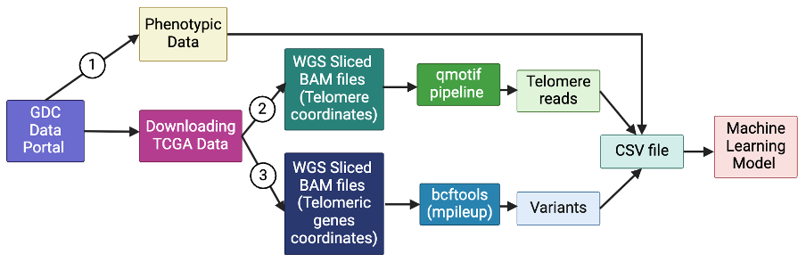
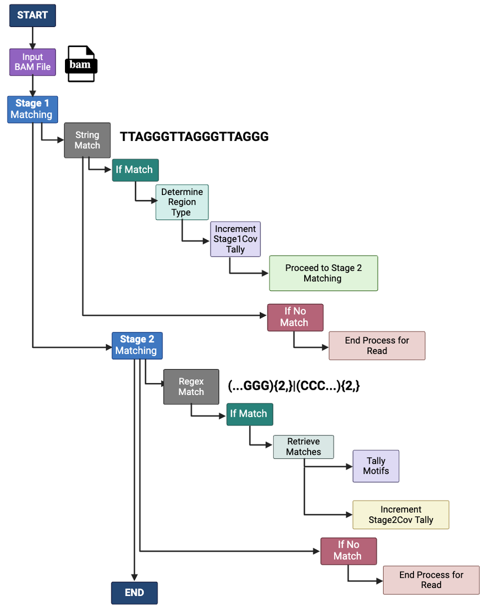

# TeloQuest

## TeloQuest is a machine learning pipeline on a mission to uncover tumor status by analyzing telomere content variation!

* This repository contains scripts and instructions for downloading BAM files for all TCGA projects from the GDC data portal, analyzing telomere content using qmotif, saving output files with telomere data, extracting variant information for 15 telomere related genes and building a machine learning model using all these features. 
* Each step in the pipeline is outlined below, along with requirements and execution instructions.

We utilized the [GDC Data Portal](https://portal.gdc.cancer.gov/) to access the BAM files for all the TCGA projects. 



**Figure 1. TeloQuest Pipeline:**
A schematic overview of the TeloQuest pipeline used to predict tumor status based on phenotypic data, telomeric read content, and genomic variants. The pipeline consists of the following key steps: (1) Downloading phenotypic data for all 33 cancer types from The Cancer Genome Atlas (TCGA) and compiling it into a CSV file; (2) Downloading whole-genome sequencing (WGS) BAM files, slicing the BAM files according to telomeric regions, using the qmotif pipeline to quantify the telomeric reads, which are then compiled into a CSV file; (3) Re-downloading the same WGS BAM files, slicing them at the loci of 15 telomere length-associated genes, and identifying variants using bcftools “mpileup” command, followed by integration of variants data into the existing CSV file containing phenotypic and telomeric read information. The final integrated CSV file then serves as the input for training the machine learning model for tumor prediction. [Figure created with BioRender.com].

## Table of Contents
* [Requirements](#requirements)
* [Additional Things to Prepare](#additional-things-to-prepare)
* [File Descriptions](#file-descriptions)
* [Usage](#usage)
* [Detailed Steps](#detailed-steps)
* [Outputs](#outputs)
* [Contact](#contact)

## Requirements
To run this pipeline, you'll need:
1. **Controlled-data Access Authorization**: Follow the steps on [GDC](https://gdc.cancer.gov/access-data/obtaining-access-controlled-data) to get access to the controlled data (aka the BAM files).

2. **GDC Download Token**: The token is required to download the controlled access data. To download controlled-access data, ensure that the authentication token is stored in the same folder as the scripts. The token is valid for **30 days** from the date of download and can only be used once. For instance, if you use a token to download BAM files for the **TCGA-ACC** project, you will need a new token to download BAM files for the **TCGA-GBM** project. Additionally, you can only download controlled-access files for **one project at a time**—requesting a new token will immediately invalidate the previous one. However, if multiple team members have access to the portal, each person can generate and use their own individual tokens at the same time. **Please be responsible with the tokens and do not share them with anyone, as this is controlled-access data**.

3. **samtools**: Required to generate BAM Index (BAI) files for the corresponding BAM files
 
4. **qmotif**: Download and install qmotif ([Documentation here](https://adamajava.readthedocs.io/en/latest/qmotif/qmotif_1_0/)).



**Figure 2. Workflow for Telomere Content Variation Pipeline.**
Schematic representation of the qmotif-based pipeline used to estimate telomere content variation across samples from TCGA data. The workflow involves extracting and quantifying telomeric reads from whole-genome sequencing data using qmotif v1.0. The tool operates through a two-stage matching system: in Stage 1, a simple string match is used to identify canonical telomeric repeats, while in Stage 2, a more complex regular expression is applied to detect variant telomeric sequences. At the end of Stage 2, a tally of all identified motifs is done, and the final number is recorded. [Figure created with BioRender.com].

5. **Java**: Required to run qmotif

6. **bcftools**: Required to obtain variants for the 15 telomere-related genes

7. **Anaconda for Jupyter notebook**: Required to build the machine learning model

## **Additional Things to Prepare:** 
* I.) If you're only interested in certain chromosomal coordinates from the BAM file, get the specific coordinates using [UCSC's Genome Browser](https://genome.ucsc.edu/cgi-bin/hgGateway). TCGA data on the GDC Portal has been harmonized and mapped to the GRCh38 human reference genome build, so please be aware of this when you get the coordinates and ensure they are from the correct build. 

* II.) Refer to the sample script `Kidney_TCGA_KICH_loop.sh` which utilizes the BAM files for UUIDs mentioned in the TSV file - `Kidney_TCGA_KICH_curl.tsv`

* III.) Generate a similar TSV file using "Cohort Builder" and "Repository" on the GDC Data Portal. 

///  **Steps to Download a Sample Sheet with UUIDs from the GDC Portal:**  
1. **Open the Cohort Builder**  
   - Click on **Cohort Builder** and select the program (e.g., **TCGA**).  
   - Choose the project (e.g., **TCGA-KICH**).  

2. **Select Features for Your Cohort**  
   - Customize your cohort by selecting relevant features such as:  
     - **Disease type**  
     - **Primary diagnosis**  
     - **Primary site**  
     - **Tissue or organ of origin**  
     - **Gender, race, ethnicity**  
     - **Vital status**  
     - **Site of biopsy**  
     - **Prior malignancy**  
     - **Tissue type**  
     - **Data format, etc.**  

3. **Save Your Cohort**  
   - Once all features are selected, click **Save the Cohort** and assign it a name.  

4. **Access the Repository**  
   - Now, navigate to the **Repository** and refine your selection by specifying:  
     - **Experimental strategy**  
     - **Data type**  
     - **Data format**  
     - **Type of access**  
     - **Tissue type**  
     - **Specimen type**  

5. **Download the Sample Sheet**  
   - Click the **Download Sample Sheet** button to generate a file containing the **UUIDs** for all selected files from your chosen project.  

6. **Verify the Sample Sheet**  
   - Review the downloaded file to ensure it includes all the selected features.  
   - If working on multiple projects, give each sample sheet a **unique name** for better organization.  

* IV.) Reference Genome FASTA (GRCh38.d1.vd1.fa) and FASTA index files (GRCh38.d1.vd1.fa.fai) were obtained from [NCI's website](https://gdc.cancer.gov/about-data/gdc-data-processing/gdc-reference-files). 
* v.) More information on BAM slicing using GDC Data Portal is available [here](https://docs.gdc.cancer.gov/Data_Portal/Users_Guide/BAMslicing/).

## Gene symbols, names, and genomic coordinates of the 15 telomere-related genes for which variants have been captured from the paper by Burren et al. (2024).

No.	Gene Symbol	- Gene Full Name - Genomic coordinates
1.	DCLRE1B -	DNA cross-link repair 1B	- chr1:113905326-113914086
2.	NAF1 -	Nuclear assembly factor 1 ribonucleoprotein	- chr4:163128669-163166890
3.	TERT -	Telomerase reverse transcriptase	- chr5:1253167-1295068
4.	G3BP1	- G3BP stress granule assembly factor 1	- chr5:151771954-151812785
5.	ZNF451 - Zinc finger protein 451	- chr6:57090188-57170305
6.	POT1	- Protection of telomeres 1	- chr7:124822386-124929825
7.	TERF1	- Telomeric repeat binding factor 1	- chr8:73008864-73048123
8.	STN1	- STN1 subunit of CST complex	- chr10:103877569-103918184
9.	ATM	- ATM serine/threonine kinase	- chr11:108223067-108369102
10.	TINF2	- TERF1 interacting nuclear factor 2	- chr14:24239643-24242623
11.	PARN	- Poly(A)-specific ribonuclease	- chr16:14435701-14630260
12.	CTC1	- CST telomere replication complex component 1	- chr17:8224815-8248056
13.	BRIP1	- BRCA1 interacting DNA helicase 1	- chr17:61679139-61863528
14.	SAMHD1	- SAM and HD domain containing deoxynucleoside triphosphate triphosphohydrolase 1	- chr20:36890229-36951708
15.	RTEL1	- Regulator of telomere elongation helicase 1	- chr20:63658312-63696245

## File Descriptions
* **`Kidney_TCGA_KICH_curl.tsv`**: A TSV file containing all the UUIDs for the TCGA project of interest. This file specifically includes UUIDs for both normal and tumor BAM files from the TCGA-KICH project.
* **`Kidney_TCGA_KICH_loop.sh`**: A Bash script that performs curl requests to download and slice BAM files based on specified genomic regions. The regions used here are telomeric coordinates obtained using UCSC's LiftOver tool.
* **`bamindex.sh`**: A Bash script that uses samtools to generate corresponding BAI index files for the downloaded BAM files.
* **`Kidney_TCGA_KICH.py`**: A Python script that runs qmotif on the BAM and BAI files to analyze telomere content.
* **`Kidney_TCGA_KICH_gene_loop.sh`**: A Bash script that performs curl requests to download and slice BAM files based on specified genomic regions. The regions used here are for 15 telomere-related genes.
* **`runbcftools.sh`**: A Bash script that runs the bcftools mpileup command on all BAM files to call variants for 15 telomere-related genes.
* **`variantstxt.sh`**: A Bash script that loops over all generated VCF files and formats the variant data into TXT files. Each line is sorted in the CHROM\tPOS\tREF\tALT\t%GT\n format for the corresponding BAM file.
* **`allgenotype.py`**: A Python script that performs genotype encoding, mapping: "0/0" → 0, "0/1" → 1, "1/1" → 2, "./." → None


* **Note**: The GDC Portal allows you to download **BAM files and other controlled-access files for only one project at a time**. If you generate multiple tokens simultaneously, the system will automatically invalidate the second-to-last token, even if it has not been used. Additionally, once a token has been used to download files, it will immediately expire. Therefore, every time you need to download new files, you must obtain a **new token**.

## Usage
## Sequence of Execution
To use the pipeline, run the scripts in the following order:
1. `Kidney_TCGA_KICH_loop.sh` (requires: `Kidney_TCGA_KICH_curl.tsv`, generates: sliced BAM files according to telomeric regions)
2. `bamindex.sh` (requires: samtools, BAM files, generates: BAI files)
3. `Kidney_TCGA_KICH.py` (requires: qmotif, BAM and BAI files, generates: `log.txt` and `output.txt` files)
4. `Kidney_TCGA_KICH_gene_loop.sh` (requires: `Kidney_TCGA_KICH_curl.tsv`, generates: sliced BAM files according to 15 telomere-related genes)
5. `runbcftools.sh` (requires: GRCh38 reference fasta file, bcftools, sliced BAM files according to 15 telomere-related genes, generates: VCF files)
6. `variantstxt.sh` (requires: VCF files, generates: Plain TXT files with variant data)
7. `allgenotype.py` (requires: Folder of TXT files with variant data, generates: summary CSV file of mutation counts per file)


* **Download Recommendations**: For optimal performance when downloading these files, we recommend using a Linux-based system or macOS. Due to the large file sizes, these operating systems tend to handle extensive downloads more reliably and efficiently than some alternatives. Additionally, we suggest ensuring a stable internet connection to minimize interruptions during the download process.

* **Note**: When working with long-running processes, such as data analysis scripts or large data transfers, it’s often helpful to use tools like `tmux` and `nohup` to keep the process running even if your session disconnects. Documentation on [tmux](https://github.com/tmux/tmux/wiki) and [nohup](https://phoenixnap.com/kb/linux-nohup) available here.

## Detailed Steps
1. **Download the (sliced) BAM files for telomeric regions**
* Run `Kidney_TCGA_KICH_loop.sh` to download the sliced BAM files from the GDC Data Portal. Make sure to:
* Include regions that you want the sliced BAM files to have, and that both the token and `Kidney_TCGA_KICH_curl.tsv` are in the same folder.

```
chmod +x Kidney_TCGA_KICH_loop.sh
```

```
./Kidney_TCGA_KICH_loop.sh
```
**OR**

```
bash Kidney_TCGA_KICH_loop.sh
```

2. **Get the BAM Index files for each BAM file**
* Before running bamindex.sh, ensure samtools is installed, and that all the BAM files are located in the same directory.

```
chmod +x bamindex.sh
```

```
./bamindex.sh
```
**OR**

```
bash bamindex.sh
```

3. **Run qmotif with Kidney_TCGA_KICH.py**
* Before running this script, make sure the following are in place:
  1. qmotif is installed and accessible from your system's path.
  2. You’ve set the correct paths to your qmotif executable, as well as your BAM and BAI input files.

* This script expects input file names without extensions (i.e., no .bam or .bai).
* A quick way to prepare the list:
I copied the names of all the BAI files generated at the end of the previous script (bamindex.sh), pasted them into a Google Doc, and used the Find and Replace feature (Cmd + F on Mac or Ctrl + F on Windows). I searched for “.bai” and replaced it with an empty string using the Replace All feature.

```
python3 Kidney_TCGA_KICH.py
```

4. **Download the (sliced) BAM files for 15 telomere-related genes regions**
* Run `Kidney_TCGA_KICH_gene_loop.sh` to download the sliced BAM files from the GDC Data Portal. Make sure to:
* Include regions that you want the sliced BAM files to have, and that both the token and `Kidney_TCGA_KICH_curl.tsv` are in the same folder.

```
chmod +x Kidney_TCGA_KICH_gene_loop.sh
```

```
./Kidney_TCGA_KICH_gene_loop.sh
```
**OR**

```
bash Kidney_TCGA_KICH_gene_loop.sh
```

//////
4. **Parse qmotif Log Files**
* Use `stage2.py` to parse log files created by `runqmotif.py`. This script will output telomere read counts for each chromosome in a file named `{sequence_name}_stage2_coverage.txt`.

```
python3 stage2.py
```

5. **Generate Chromosome-Level Tally of Telomeric reads**
* Run `realcoverage.sh` to tally telomeric reads for each chromosome. This script uses the `chrnames` file, so make sure it’s in the same folder. 
* **Note**: The `chrnames` file only has chromosome numbers for autosomes; sex chromosomes are not included.

```
bash realcoverage.sh
```

6. **Extract Scaled Telomeric Reads for all the samples**
*  Run `scaledgenomic.sh` file to extract scaled telomeric reads data from output files created by `runqmotif.py`. This generates a file named `ScaledGenomicOutput.txt`.

```
bash scaledgenomic.sh
```

## Outputs

1. `{ProjectID}_${CaseID}_${SampleType}.bam`: BAM files sliced according to telomeric regions (output of `Kidney_TCGA_KICH_loop.sh`)
2. `{filename}.bai`: BAM index (BAI) files for the sliced BAM files (output of `bamindex.sh`)
3. `{sequence_name}_terminal_output.txt`: Chromosome-specific telomeric read counts (output of `Kidney_TCGA_KICH.py`)
4. `{ProjectID}_${CaseID}_${SampleType}.bam`: BAM files sliced according to the telomere-related genes (output of `Kidney_TCGA_KICH_gene_loop.sh`) 
5. `{base_name}_variants.vcf.gz`: VCF file containing the genomic variants info for each file (output of `runbcftools.sh`)
6. `{basename}.txt`: Generates a TXT file from the VCF file in the CHROM\tPOS\tREF\tALT\t%GT\n format (output of `variantstxt.sh`)
7. `{ProjectID}_mutation_summary.csv`: A CSV file that has the mutation summary of all samples for that TCGA Project (output of `allgenotype.py`)

## Contact
* If you’d like to discuss this project or get in touch for other inquiries, please email me at priyanshishah213@gmail.com or connect with me on [LinkedIn](https://www.linkedin.com/in/priyanshi-p-shah/).
