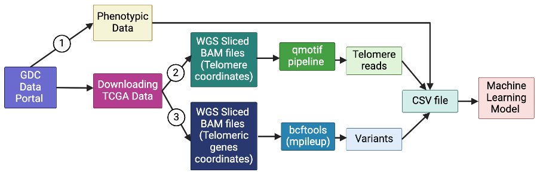

# TeloQuest: Telomere-Based Tumor Classification Pipeline

This repository presents a Snakemake pipeline for downloading BAM files for TCGA projects from the GDC Data Portal, estimating telomere content using qmotif, extracting variant information for 15 telomere-related genes, and producing a summary CSV used to train a machine learning model for tumor classification. We utilized the [GDC Data Portal](https://portal.gdc.cancer.gov/)  to access the BAM files for all TCGA projects.



**Figure 1. TeloQuest Pipeline:**
A schematic overview of the TeloQuest pipeline used to predict tumor status based on phenotypic data, telomeric read content, and genomic variants. The pipeline consists of the following key steps: (1) Downloading phenotypic data for all 33 cancer types from The Cancer Genome Atlas (TCGA) and compiling it into a CSV file; (2) Downloading whole-genome sequencing (WGS) BAM files, slicing the BAM files according to telomeric regions, using the qmotif pipeline to quantify the telomeric reads, which are then compiled into a CSV file; (3) Re-downloading the same WGS BAM files, slicing them at the loci of 15 telomere length-associated genes, and identifying variants using bcftools “mpileup” command, followed by integration of variants data into the existing CSV file containing phenotypic and telomeric read information. The final integrated CSV file then serves as the input for training the machine learning model for tumor prediction. [Figure created with BioRender.com].

## Table of Contents
* [Requirements](#requirements)
* [Additional Things to Prepare](#additional-things-to-prepare)
* [File Descriptions](#file-descriptions)
* [Usage](#usage)
* [Repository Structure](#repository-structure)
* [Setup](#setup)
* [Outputs](#outputs)
* [Citation](#citation)
* [Contact](#contact)

## Requirements
To run this pipeline, you'll need:
1. **Controlled-data Access Authorization**: Follow the steps on [GDC](https://gdc.cancer.gov/access-data/obtaining-access-controlled-data) to get access to the controlled data (the BAM files).

2. **GDC Download Token**: Required to download controlled-access data. Save it as gdc-user-token.txt in the repo root.

* Tokens are valid for 30 days from the date of issue and can be reused for multiple downloads within that window — they are not single-use.
* Generating a new token immediately invalidates the previous one, so avoid regenerating mid-run.
* If multiple team members have portal access, each person can generate and use their own individual token independently.
**Please be responsible with tokens and do not share them, as this is controlled-access data**.

3. **Conda environments for the following tools, pinned to specific versions** (see [Setup](#setup) for why):

* Snakemake
* samtools 1.12 — used to generate BAM Index (BAI) files
* bcftools 1.21 — used to call variants for the 15 telomere-related genes
* pandas — used for genotype aggregation
 
4. **qmotif**: Download and install qmotif ([Documentation here](https://adamajava.readthedocs.io/en/latest/qmotif/qmotif_1_0/)).

* A note on qmotif scaling: qmotif normalizes raw motif counts against a BAM file's total read count, scaled to 1 billion reads, so that samples with different sequencing depths can be compared on the same scale. This scaling treats every read equally and doesn't account for factors like unmapped reads or copy number changes (e.g., whole-arm amplifications), since there's no single "correct" way to adjust for those in tumor samples. Despite this simplicity, qmotif's scaled scores have been shown to correlate well with wet-lab telomere length measurements. See the qmotif [documentation](https://adamajava.readthedocs.io/en/latest/qmotif/qmotif_1_2/) for more detail.


**Figure 2. Workflow for Telomere Content Variation Pipeline.**
Schematic representation of the qmotif-based pipeline used to estimate telomere content variation across samples from TCGA data. The workflow involves extracting and quantifying telomeric reads from whole-genome sequencing data using qmotif v1.0. The tool operates through a two-stage matching system: in Stage 1, a simple string match is used to identify canonical telomeric repeats, while in Stage 2, a more complex regular expression is applied to detect variant telomeric sequences. At the end of Stage 2, a tally of all identified motifs is done, and the final number is recorded. [Figure created with BioRender.com].

5. **Java**: Required to run qmotif

## **Additional Things to Prepare:** 
I.) If you're only interested in certain chromosomal coordinates from the BAM file, get the specific coordinates using [UCSC's Genome Browser](https://genome.ucsc.edu/cgi-bin/hgGateway). TCGA data on the GDC Portal has been harmonized and mapped to the GRCh38 human reference genome build, so please be aware of this when you get the coordinates and ensure they are from the correct build. 

II.) Refer to the sample TSV file `Kidney_TCGA_KICH_curl.tsv`, which lists UUIDs used by the pipeline.

III.) Generate a similar TSV file using "Cohort Builder" and "Repository" on the GDC Data Portal. 

=> **Steps to Download a Sample Sheet with UUIDs from the GDC Portal:**  
1. **Open the Cohort Builder**  
   - Click on **Cohort Builder** and select the program (e.g., **TCGA**).  
   - Choose the project (e.g., **TCGA-KICH**).  

2. **Select Features for Your Cohort**  
   - Customize your cohort by selecting relevant features such as: **Disease type**, **Primary diagnosis**, **Primary site**, **Tissue or organ of origin**, **Gender, race, ethnicity**, **Vital status**, **Site of biopsy**, **Prior malignancy**, **Tissue type**, **Data format, etc.**  

3. **Save Your Cohort**  
   - Click **Save the Cohort** and assign it a name.  

4. **Access the Repository**  
   - Navigate to the **Repository** and refine your selection by specifying: **Experimental strategy**, **Data type**, **Data format**, **Type of access**, **Tissue type**, **Specimen type, etc.** 

5. **Download the Sample Sheet**  
   - Click **Download Sample Sheet** to generate a file containing the **UUIDs** for all selected files.  

6. **Verify the Sample Sheet**  
   - Review the downloaded file to ensure it includes all the selected features.  
   - If working on multiple projects, give each sample sheet a **unique name** for better organization.  

IV.) Reference Genome FASTA `(GRCh38.d1.vd1.fa)` and FASTA index files `(GRCh38.d1.vd1.fa.fai)` were obtained from [NCI's website](https://gdc.cancer.gov/about-data/gdc-data-processing/gdc-reference-files). 

V.) More information on BAM slicing using GDC Data Portal is available [here](https://docs.gdc.cancer.gov/Data_Portal/Users_Guide/BAMslicing/).

## Gene symbols, names, and genomic coordinates of the 15 telomere-related genes for which variants are captured, from [Burren et al. (2024)](https://www.nature.com/articles/s41588-024-01884-7).

No.	Gene Symbol	- Gene Full Name - Genomic coordinates
1.	DCLRE1B -	DNA cross-link repair 1B	- chr1:113905326-113914086
2.	NAF1 -	Nuclear assembly factor 1 ribonucleoprotein	- chr4:163128669-163166890
3.	TERT -	Telomerase reverse transcriptase	- chr5:1253167-1295068
4.	G3BP1	- G3BP stress granule assembly factor 1	- chr5:151771954-151812785
5.	ZNF451 - Zinc finger protein 451	- chr6:57090188-57170305
6.	POT1	- Protection of telomeres 1	- chr7:124822386-124929825
7.	TERF1	- Telomeric repeat binding factor 1	- chr8:73008864-73048123
8.	STN1	- STN1 subunit of CST complex	- chr10:103877569-103918184
9.	ATM	- ATM serine/threonine kinase	- chr11:108223067-108369102
10.	TINF2	- TERF1 interacting nuclear factor 2	- chr14:24239643-24242623
11.	PARN	- Poly(A)-specific ribonuclease	- chr16:14435701-14630260
12.	CTC1	- CST telomere replication complex component 1	- chr17:8224815-8248056
13.	BRIP1	- BRCA1 interacting DNA helicase 1	- chr17:61679139-61863528
14.	SAMHD1	- SAM and HD domain containing deoxynucleoside triphosphate triphosphohydrolase 1	- chr20:36890229-36951708
15.	RTEL1	- Regulator of telomere elongation helicase 1	- chr20:63658312-63696245

## File Descriptions

* **`Snakefile`** — defines the full pipeline as a set of Snakemake rules, run per sample
* **`Kidney_TCGA_KICH_curl.tsv`** — TSV file containing UUIDs for the TCGA project of interest; includes UUIDs for both normal and tumor BAM files from the TCGA-KICH project
* **`slice_bam_telomere.sh`** — performs a curl request to download and slice one sample's BAM file based on telomeric coordinates (obtained using UCSC's LiftOver tool)
* **`slice_bam_genes.sh`** — performs a curl request to download and slice one sample's BAM file based on the 15 telomere-related gene regions
* **`run_qmotif.py`** — runs qmotif on one sample's BAM and BAI files to analyze telomere content
* **`run_bcftools.sh`** — runs bcftools mpileup/call on one sample's gene-region BAM file to call variants
* **`variants_to_txt.sh`** — formats one sample's VCF file into a plain TXT file, with each line in CHROM\tPOS\tREF\tALT\t%GT\n format
* **`aggregate_genotypes.py`** — encodes genotypes ("0/0" → 0, "0/1" → 1, "1/1" → 2, "./." → None) across all samples and produces the final mutation summary CSV

* **Note**: This pipeline previously ran as a set of standalone scripts executed manually in sequence, looping over hardcoded sample lists. It has since been converted to a Snakemake pipeline: each script now processes one sample at a time, and Snakemake automatically handles looping, dependency tracking, and resuming after failures.

## Repository Structure
```
TeloQuest/
├── Snakefile
├── Kidney_TCGA_KICH_curl.tsv
├── gdc-user-token.txt          (not included — see Setup)
├── GRCh38.d1.vd1.fa             (not included — see Setup)
├── qmotif.ini
├── slice_bam_telomere.sh
├── slice_bam_genes.sh
├── run_qmotif.py
├── run_bcftools.sh
├── variants_to_txt.sh
├── aggregate_genotypes.py
└── README.md
```

## Setup

1. Clone the repository

```
git clone https://github.com/paribytes/TeloQuest.git
cd TeloQuest
```
2. Create conda environments

This pipeline depends on specific versions of samtools and bcftools, since later versions of these tools can call variants slightly differently (tested difference: roughly ±1–2% in total mutation counts). To keep results reproducible, this pipeline was built and validated using samtools 1.12 and bcftools 1.21.

Because these two versions require incompatible versions of htslib, they can't be installed in the same conda environment. Create two separate environments:

```
conda create -n samtools_1_12_env -c bioconda -c conda-forge samtools=1.12
conda create -n bcftools_1_21_env -c bioconda -c conda-forge bcftools=1.21
```

If conda's solver fails, try setting flexible channel priority first:
```
conda config --set channel_priority flexible
```
Create a third environment for running the pipeline itself:
```
conda create -n teloquest_env -c bioconda -c conda-forge snakemake pandas
```

3. Update tool paths

The Snakefile and shell scripts call samtools and bcftools using absolute paths, since they live in separate environments. After creating the environments above, find their install locations:

```
conda activate samtools_1_12_env && which samtools
conda activate bcftools_1_21_env && which bcftools
```
Update the paths at the top of the Snakefile, `run_bcftools.sh`, and `variants_to_txt.sh` if yours differ from the defaults.

4. GDC authentication token

Generate a token from the GDC Data Portal (requires dbGaP authorized access) and save it as `gdc-user-token.txt` in the repo root. See the token notes under [Requirements](requirements).


5. Reference genome

Place `GRCh38.d1.vd1.fa` in the repo root (see [Additional Things to Prepare](additional-things-to-prepare)).

6. qmotif

Make sure `qmotif` and its dependencies are on your PATH, and that `qmotif.ini` is present in the repo root.

7. Sample sheet

Provide your TSV file (see [Additional Things to Prepare](additional-things-to-prepare)), named to match what's referenced at the top of the Snakefile.

If your TSV was edited in Excel, check for hidden carriage returns or blank trailing lines, which can cause sample-parsing errors. Clean these with:
```
tr -d '\r' < your_file.tsv | grep -v '^[[:space:]]*$' > cleaned_file.tsv
```

## Usage

Activate the pipeline environment:
```
conda activate teloquest_env
```
Do a dry run first, to check the pipeline is wired up correctly without downloading or computing anything:
```
snakemake --cores 1 -n
```
Then run for real:

```
snakemake --cores N
```
Replace `N` with the number of cores to use in parallel.

* **Download Recommendations**: For optimal performance, we recommend using a Linux-based system or macOS, given the large file sizes involved. Ensure a stable internet connection to minimize interruptions.

For long-running jobs (macOS only): prevent your machine from sleeping mid-run:

```
caffeinate -i snakemake --cores N
```

On Linux or an HPC cluster, submit this as a background/queued job instead — see documentation on [tmux](https://github.com/tmux/tmux/wiki) and [nohup](https://phoenixnap.com/kb/linux-nohup) for keeping long processes running across disconnected sessions.

If the pipeline stops partway through (e.g., due to token expiry or a network interruption), just rerun the same `snakemake` command — completed steps are cached and won't be redone.

## Outputs

* `data/{sample}_telomere.bam` and `.bai` — sliced/indexed BAM files for telomeric regions
* `data/{sample}_genes.bam` and `.bai` — sliced/indexed BAM files for the 15 telomere-related gene regions
* `results/{sample}_log.txt`, `{sample}_output.txt`, `{sample}_terminal_output.txt` — qmotif outputs, including chromosome-specific telomeric read counts
* `vcf/{sample}_variants.vcf.gz` — called variants per sample
* `txt/{sample}_variants.txt` — plain-text genotype calls per sample, in CHROM\tPOS\tREF\tALT\t%GT\n format
* `results/mutation_summary.csv` — final mutation summary across all samples, used as input for the machine learning model

## Citation
 If you use TeloQuest, please cite our [paper](https://academic.oup.com/biomethods/article/10/1/bpaf069/8254362)

```
Shah, P., & Sethuraman, A. (2025a). A novel machine learning approach for tumor detection based on telomeric signatures. Biology Methods and Protocols, 10(1). https://doi.org/10.1093/biomethods/bpaf069 
```

## Contact
* If you’d like to discuss this project or get in touch for other inquiries, please email me at priyanshishah213@gmail.com or connect with me on [LinkedIn](https://www.linkedin.com/in/priyanshi-p-shah/).
